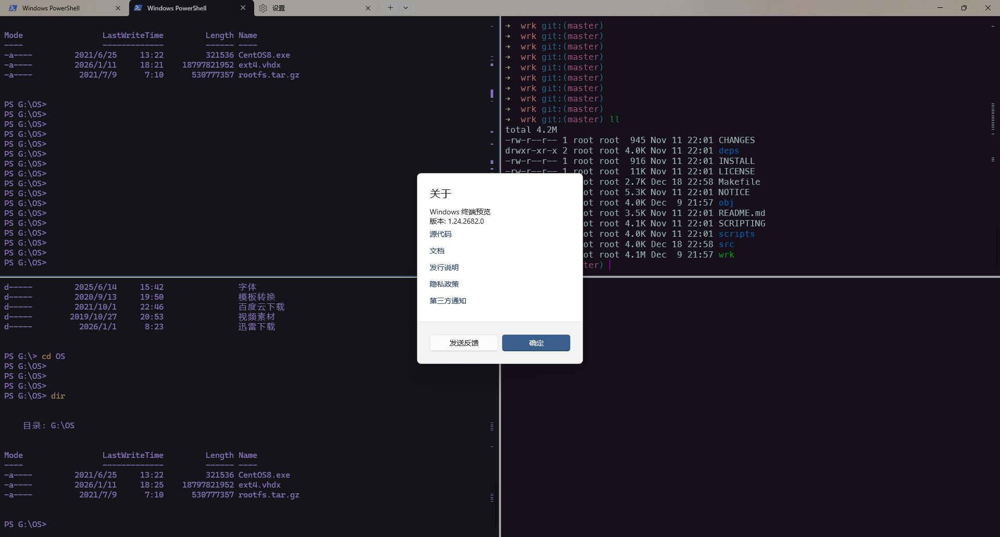
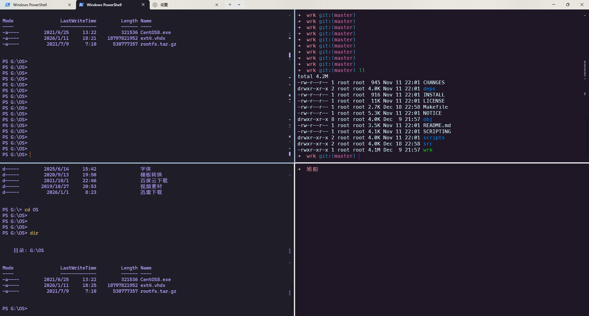
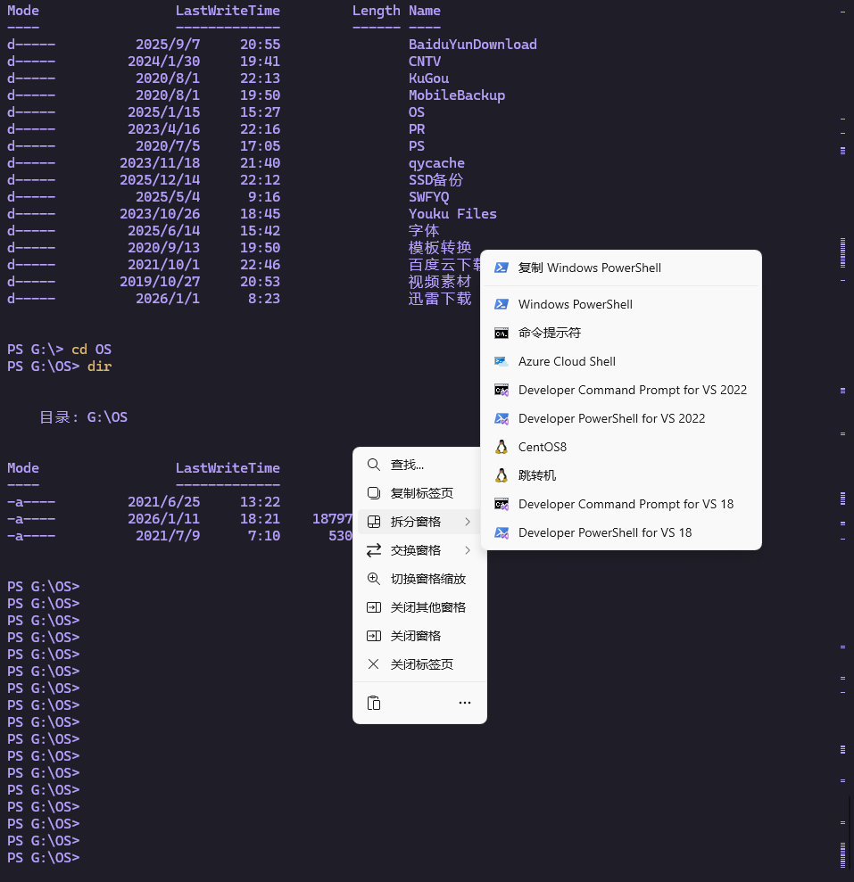

# Windows terminal 配置
预览版有：右键点击、配置分组等等，正式版等比较久，需要用预览版到github下载并安装就行。


# 快捷键配置
ctrl+shift+p 打开命令框、输命令、执行，每次重复、难用。Terminal支持按键绑定，找到 Terminal -> 设置 -> 打开json文件；下边是常用快捷键配置。


ctr+1 竖分屏，竖着劈开
ctrl+~ 横分屏，横着劈开
ctrl+enter 放大或者还原面板
ctrl+left 向左切换选项卡
ctrl+right 向右切换选项卡
ctrl+alt+f 搜索内容

```json
"keybindings":
[
    {
        "id": "Terminal.SplitPaneRight",
        "keys": "ctrl+1"
    },
    {
        "id": "Terminal.SplitPaneDown",
        "keys": "ctrl+`"
    },
    {
        "id": "Terminal.TogglePaneZoom",
        "keys": "ctrl+enter"
    },
    {
        "id": "Terminal.PrevTab",
        "keys": "ctrl+left"
    },
    {
        "id": "Terminal.NextTab",
        "keys": "ctrl+right"
    },
    {
        "id": "User.find",
        "keys": "ctrl+alt+f"
    },
],
```


# 右键分屏

```json
"profiles": 
{
    "defaults": 
    {
        "rightClickContextMenu": true,
        "startingDirectory": "%USERPROFILE%"
    },
}
```